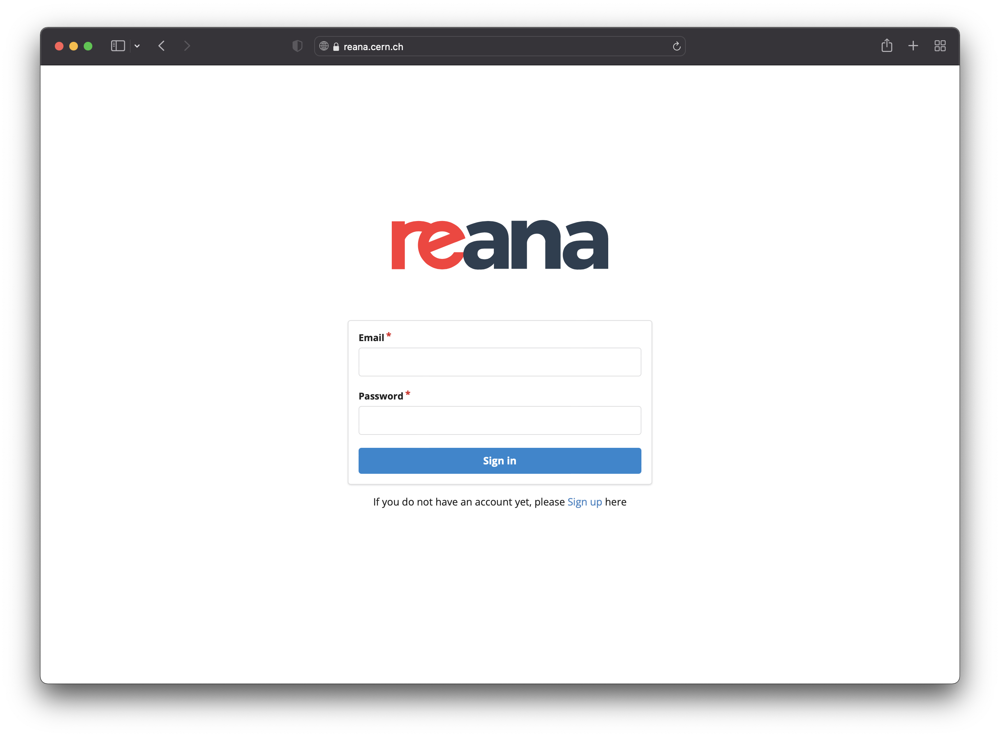
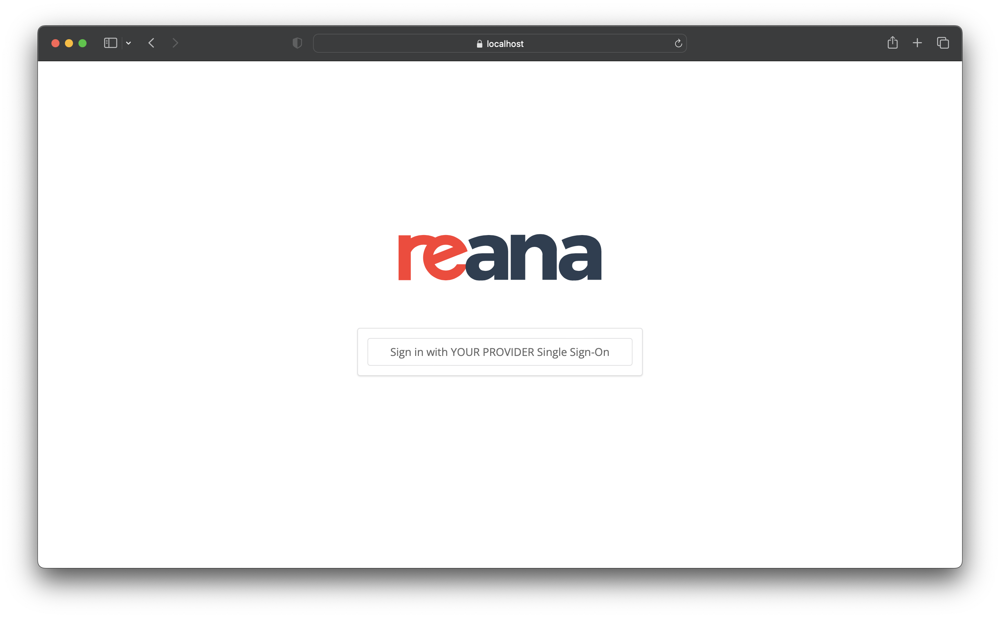
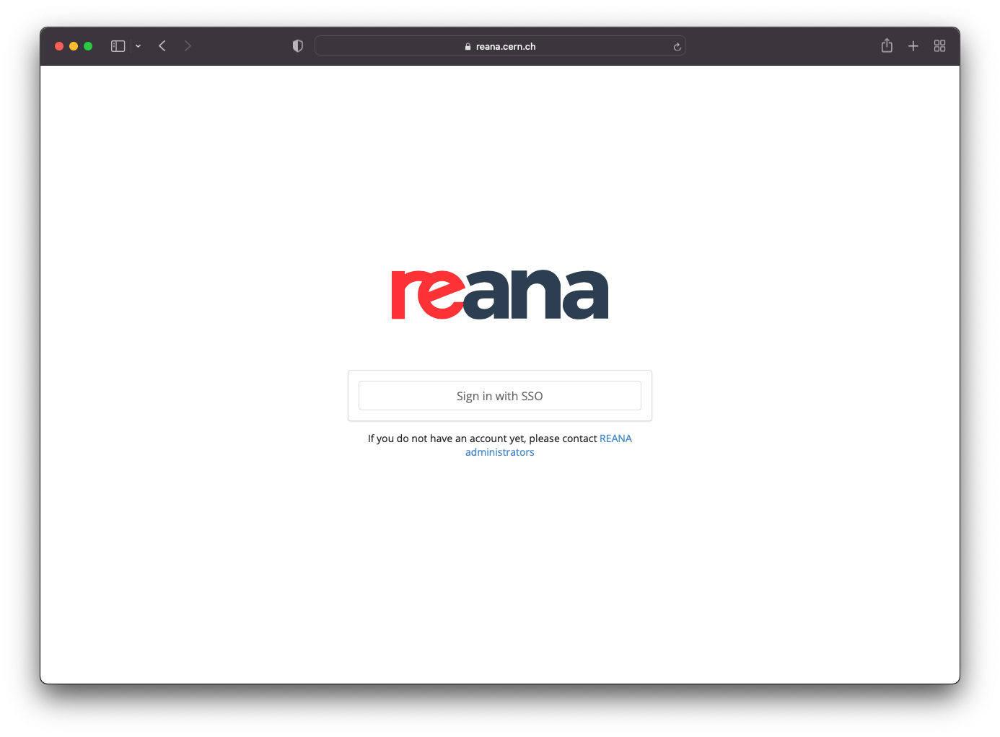

# Configuring user access

## User registration via sign up form

By exposing the REANA User Interface, the default configuration allows
users to sign-up.

When accessing the UI for the first time, users will be prompted with a
sign-in form and a link to the sign-up form:



After signing up, an email is sent to the user's email address for
confirmation. Once the email address is confirmed, the user can then ask
administrators for an access token.

If you would like to disable the email verification step, you can add
`REANA_USER_EMAIL_CONFIRMATION: false` Helm value to [`components.reana_server.environment`](https://github.com/reanahub/reana/tree/master/helm/reana).

If you would like to disable the sign-up form completely, and [add your
users manually](../../management/managing-users), you can configure
[`components.reana_ui.hide_signup`](https://github.com/reanahub/reana/tree/master/helm/reana)
Helm value accordingly.

## User registration via Single Sign-On

User access through Single-Sign-On (SSO) authentication is also possible. REANA currently supports CERN SSO as well as any third-party [Keycloak](https://www.keycloak.org/) instance.

### Keycloak Single Sign-On configuration

First of all, to integrate REANA with your Keycloak instance, you need to create a new client from the Keycloak's admin dashboard.
There are many configuration options; the following are the minimal ones that you should set:

- _Valid Redirect URIs_ should be set to `https://reana.example.org/api/oauth/authorized/keycloak/` (see Keycloak's [Access Settings](https://www.keycloak.org/docs/latest/server_admin/#access-settings));
- _Client authentication_ should be enabled in order to get the client ID and the client secret (see Keycloak's [Confidential client credentials](https://www.keycloak.org/docs/latest/server_admin/#_client-credentials)).

You can then configure REANA to use your Keycloak instance with the following configuration of the [`login`](https://github.com/reanahub/reana/tree/master/helm/reana) list in your Helm values:

- `name` can be chosen freely and will be used as an internal identifier of the Keycloak instance;
- `type` must be set to `keycloak`;
- `config.title` is the name of the Keycloak instance that will be shown to users on the web interface login page;
- `config.base_url`, `config.realm_url`, `config.auth_url`, `config.token_url` and `config.userinfo_url` should all be set to the corresponding Keycloak endpoints.

Please note that currently only one instance of `keycloak` type is supported, so the `login` array in your `values.yaml` file must contain at most one element:

```{ .yaml .copy-to-clipboard }
login:
  - name: "yourprovider"
    type: "keycloak"
    config:
      title: "YOUR PROVIDER"
      base_url: "https:/keycloak.example.org"
      realm_url: "https://keycloak.example.org/auth/realms/your-realm"
      auth_url: "https://keycloak.example.org/auth/realms/your-realm/protocol/openid-connect/auth"
      token_url: "https://keycloak.example.org/auth/realms/your-realm/protocol/openid-connect/token"
      userinfo_url: "https://keycloak.example.org/auth/realms/your-realm/protocol/openid-connect/userinfo"
```

You should then take the values of the client ID and the client secret that you obtained when you created your SSO application in the Keycloak dashboard and add it under the [`secrets.login`](https://github.com/reanahub/reana/tree/master/helm/reana) Helm value:

```yaml
secrets:
  login:
    yourprovider:
      consumer_key: <your-client-id>
      consumer_secret: <your-client-secret>
```

Note that the key `yourprovider` must match the internal identifier name you have chosen above as the name of your Keycloak instance.

Furthermore, given that email verification is already handled by Keycloak, you have to set `components.reana_server.environment.REANA_USER_EMAIL_CONFIRMATION` to `false`.
Finally, to disable signup/signin for local users, you can set `components.reana_ui.local_users` to `false`.

When accessing the web interface, this is what the login page will look like:



For further information on how to use Keycloak, see [Keycloak’s documentation](https://www.keycloak.org/docs/latest/server_admin/#_oidc_clients).

### CERN Single Sign-On configuration

Single Sign-On is available for CERN deployments via [`components.reana_ui.cern_sso`](https://github.com/reanahub/reana/tree/master/helm/reana)
Helm value. This configuration can be combined with local users or used
exclusively. When accessing the UI you will see a page like this:



When clicking on "Sign in with SSO" the users will be redirected to the
corresponding login page to enter their SSO provider credentials. Once
authenticated, they will be redirected back to REANA with their user
logged in.

You might also want to disable the local users functionality altogether
to rely only on SSO users. To do this, set [`components.reana_ui.local_users`](https://github.com/reanahub/reana/tree/master/helm/reana)
Helm value to `false`.
