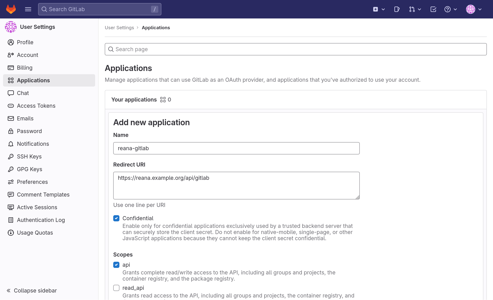

# Configuring GitLab integration

REANA can integrate with any GitLab instance to provide continuous integration for workflows that are maintained inside Git repositories.
By going to their REANA profile pages, users can enable the GitLab integration for the repositories they want, so that each change to one of them will automatically trigger the execution of a new workflow.
If you are looking for documentation on how to use this feature, please have a look at the related [Gitlab](../../../advanced-usage/code-repositories/gitlab/) page.

## Creating a new GitLab application

First of all, you will need to create a GitLab application.
You can either create:

- a user-owned application, by selecting your avatar, then _Edit Profile_ > _Applications_;
- a group-owned application, by going to the desired group, then _Settings_ > _Applications_;
- an instance-wide application, by going to _Admin Area_ > _Applications_.

There you will need to set the following values:

- _Name_ will be the name of the GitLab app, for example `reana-gitlab`;
- _Redirect URI_ should be set to the URL of the REANA instance followed by `/api/gitlab`, for example `https://reana.example.org/api/gitlab`;
- _Confidential_ should be selected;
- In _Scopes_, only `api` needs to be enabled.

{.screenshot-browser-mockup}

To learn more about this, you can also check out GitLab's docs on how to [create OAuth applications](https://docs.gitlab.com/ee/integration/oauth_provider.html).

## Configuring GitLab's secrets in REANA

After saving your application, GitLab will provide to you the client ID and the client secret of the application you have just created.
You then need to pass these values to REANA, by setting the following [Helm values](https://github.com/reanahub/reana/tree/master/helm/reana):

- `secrets.gitlab.REANA_GITLAB_OAUTH_APP_ID` should be set to the client ID;
- `secrets.gitlab.REANA_GITLAB_OAUTH_APP_SECRET` should be set to the client secret;
- `secrets.gitlab.REANA_GITLAB_HOST` should be set to the hostname of the GitLab instance you are using, for example `gitlab.example.org`.

As an example:

```{ .yaml .copy-to-clipboard }
secrets:
  gitlab:
    REANA_GITLAB_OAUTH_APP_ID: "<your-client-ID>"
    REANA_GITLAB_OAUTH_APP_SECRET: "<your-client-secret>"
    REANA_GITLAB_HOST: "gitlab.example.org"
```
