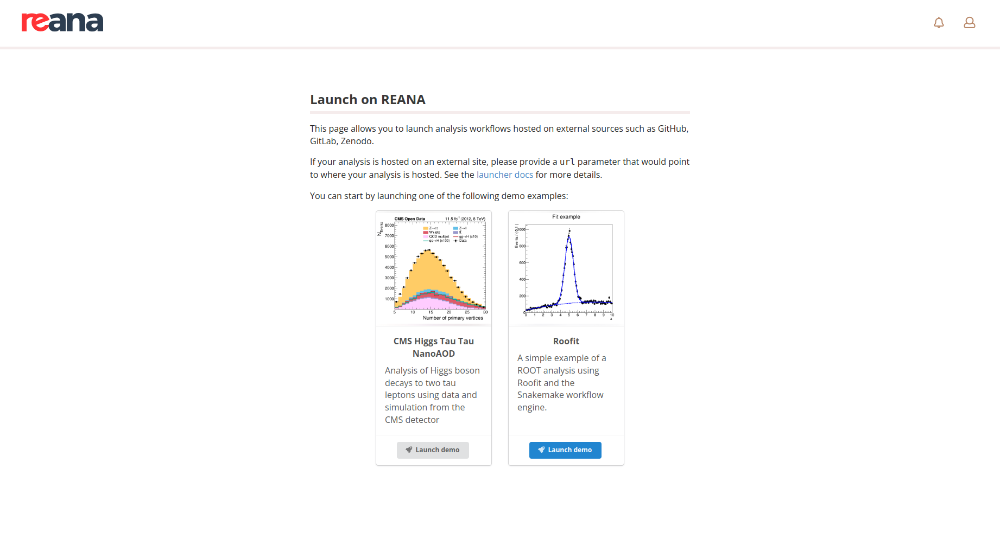

# Configuring web interface

REANA provides administrators with the ability to customise some aspects of the web user
interface to suit their specific requirements.

## Changing the launcher examples

When visiting the `/launch` page without supplying any URL parameter,
a gallery of example analyses that can be launched on the
REANA cluster is shown. The list of examples can be customised by means of the
[`components.reana_ui.launcher_examples`](https://github.com/reanahub/reana/tree/master/helm/reana)
Helm value. This value is a list of objects, each of which has the following fields:

- `name`: the name of the example, which will be shown in the UI and be used to generate the
analysis name.
- `url`: the URL to the repository containing the example. For more info on the supported URLs, visit
the [related documentation page](../../../running-workflows/launching-workflows#url-required).
- `image_url`: the URL to the image that will represent the example in the gallery.
- `description` (optional): a brief description of what the example analysis is.
- `specification` (optional): the name of the REANA specification file, if it differs from the default `reana.yaml`.

Below is an example YAML snippet that demonstrates how to configure the launcher examples:

```{ .yaml .copy-to-clipboard }
reana_ui:
  launcher_examples:
    - name: CMS Higgs Tau Tau NanoAOD
      description: Analysis of Higgs boson decays to two tau leptons using data and simulation from the CMS detector
      image_url: https://raw.githubusercontent.com/cms-opendata-analyses/HiggsTauTauNanoAODOutreachAnalysis/master/plots/npv.png
      url: https://github.com/cms-opendata-analyses/HiggsTauTauNanoAODOutreachAnalysis
    - name: Roofit
      description: A simple example of a ROOT analysis using Roofit and the Snakemake workflow engine.
      image_url: https://raw.githubusercontent.com/reanahub/reana-demo-root6-roofit/master/docs/plot.png
      url: https://github.com/reanahub/reana-demo-root6-roofit
      specification: reana-snakemake.yaml
```

This configuration will result in the launcher page appearing as shown in the following screenshot:

{.screenshot-browser-mockup}

You can configure as many examples as you like. Alternatively, if no examples are provided,
the launcher page will default to displaying three standard REANA examples:

{.screenshot-browser-mockup}
