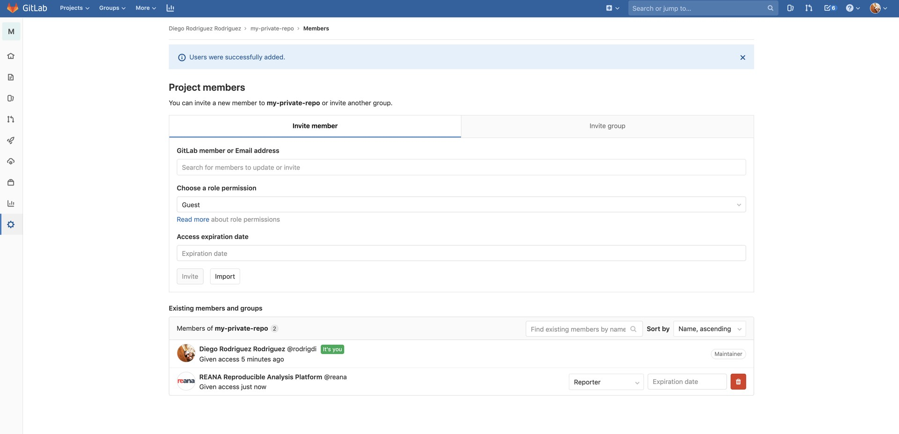

# Private Docker registries

If your workflow needs to access private Docker images, you will need to grant access to the REANA platform. The exact technique varies depending on the Docker registry, Please follow instructions below.

## CERN GitLab

Go to your project's member tab (`https://gitlab.cern.ch/johndoe/myanalysis/-/project-members`) and add the [REANA user](https://gitlab.cern.ch/reana) as a collaborator of type "reporter". This will ensure that REANA platform will be able to access your private repositories. In order to know more about GitLab project collaborators, please see [GitLab project membership permissions documentation](https://docs.gitlab.com/ee/user/permissions.html#project-members-permissions):

