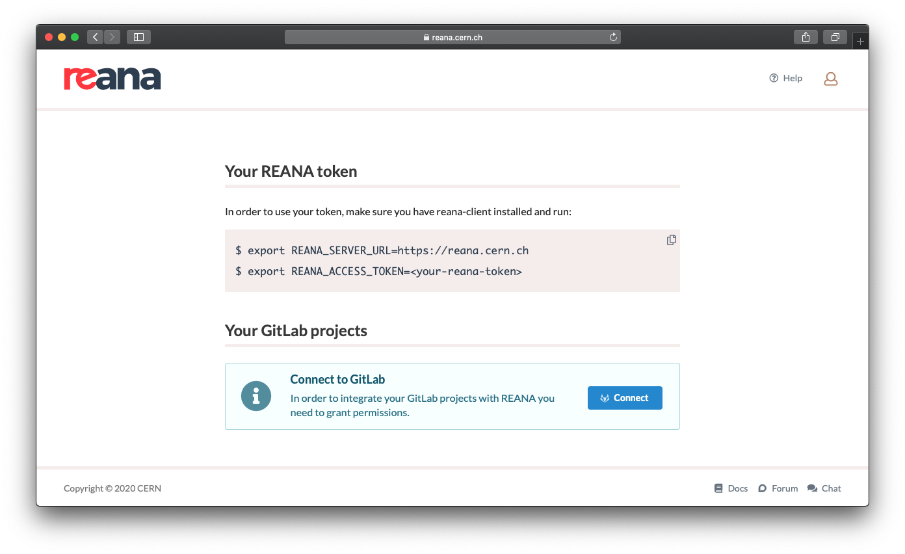
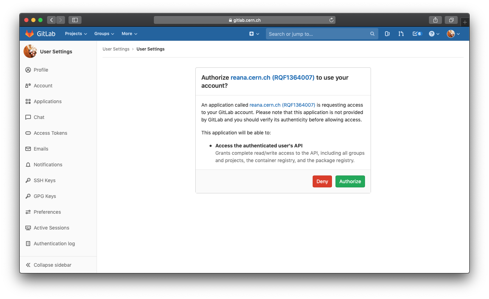
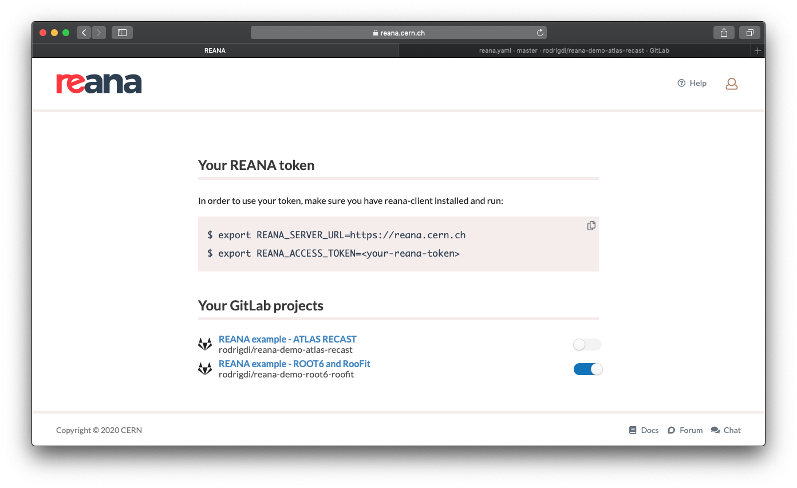
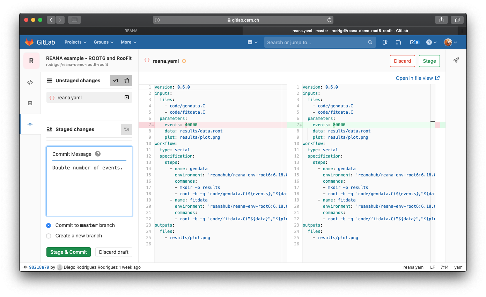
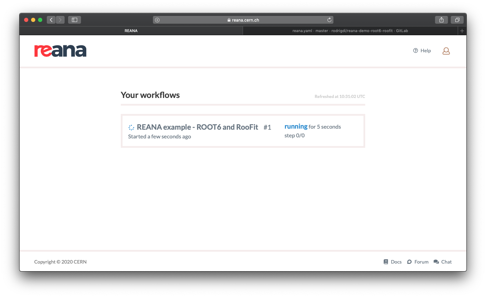

# GitLab

If your analysis code lives in GitLab, you can integrate it with REANA by automating the run of your workflow everytime you merge to master.

First of all, your analysis should be compatible with REANA, which means that you should have a valid `reana.yaml` which describes how to run it, if you do not have one, no worries, you can learn how to create one in the [`reana.yaml` section](../../../reference/reana-yaml).

Once you confirm you have a `reana.yaml`, go to [https://reana.cern.ch](https://reana.cern.ch) and open _Your profile_ page (top right corner).

Click on "Connect to GitLab" and if you agree, authorize REANA to list your projects and their status.

Once this is done, you will see that now all your GitLab projects are listed, just choose the ones you want to integrate.

Now you are ready to make a commit to your analysis master branch, in this case we will just double the number of events.

If you have a tab open with the home page, you will see that a workflow run will be created.

Once the workflow is done, the status of your last commit in GitLab will change accordingly.
