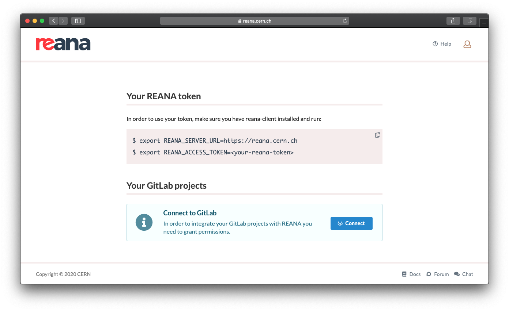
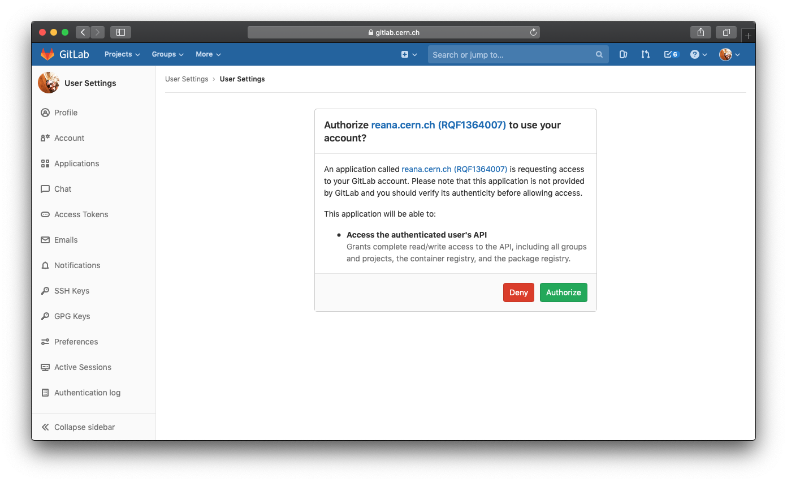
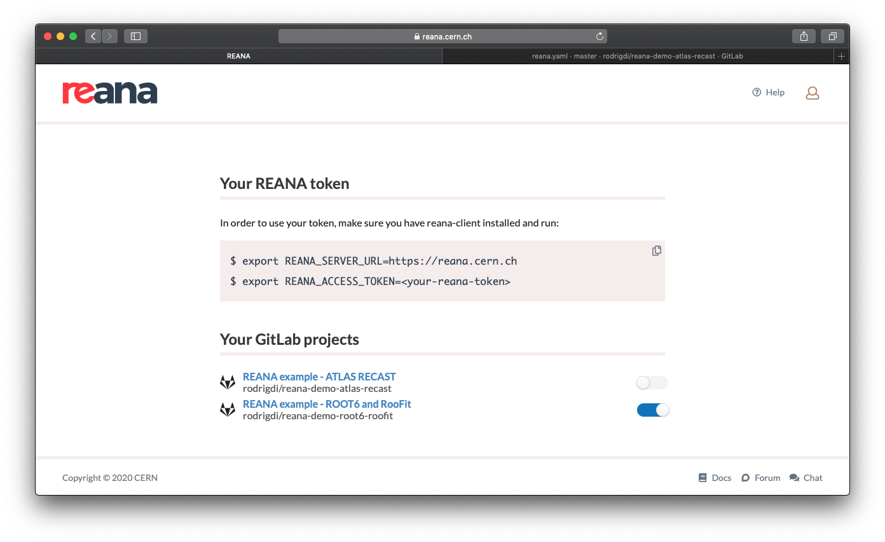
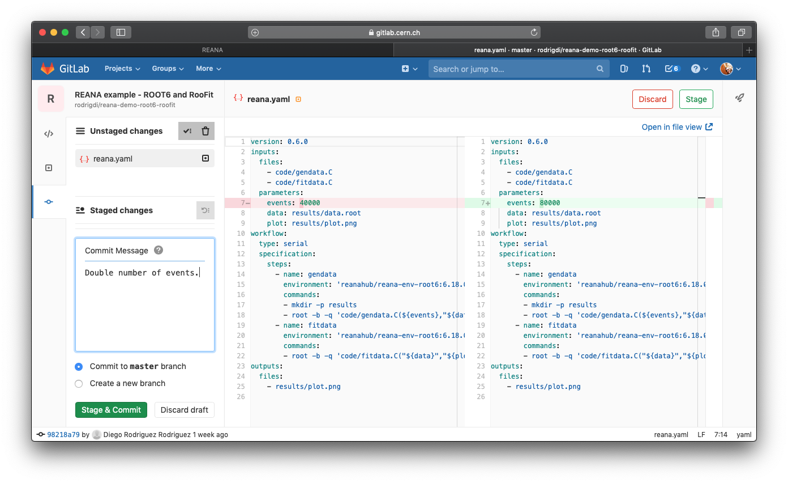
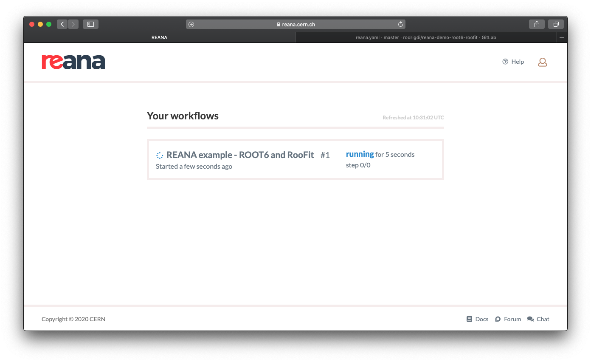

# GitLab

If your analysis code lives in GitLab, you can integrate it with REANA by automating the run of your workflow everytime you merge to master.

First of all, your analysis should be compatible with REANA, which means that you should have a valid `reana.yaml` which describes how to run it, if you do not have one, no worries, you can learn how to create one in the [`reana.yaml` section](../../../reference/reana-yaml).

Once you confirm you have a `reana.yaml`, go to [https://reana.cern.ch](https://reana.cern.ch) and open _Your profile_ page (top right corner).

Click on "Connect to GitLab" and if you agree, authorize REANA to list your projects and their status.

Once this is done, you will see that now all your GitLab projects are listed, just choose the ones you want to integrate.

GitLab webhook authorization is time-limited. Your profile shows its expiry and
lets you renew it while you are signed in to REANA. For a webhook that already
has a valid REANA-issued secret, renewal checks your current REANA entitlement
and keeps that same secret configured in your GitLab projects, so you do not
need to recreate their webhooks. After authorization expires, GitLab cannot
start new workflows until you renew it. The cluster administrator chooses the
maximum lifetime: a longer lifetime requires less frequent renewal, but also
allows webhook access to continue longer after a user's REANA role is revoked
at the identity provider.

Two situations need an extra step beyond renewing:

- **First integration after an upgrade to per-user webhook secrets.** A
  webhook created before your REANA instance introduced this per-user secret
  was never issued one, so renewing its authorization does not fix it — GitLab
  will keep receiving 401 responses. Recreate the webhook for each affected
  project from your profile page instead of renewing it.
- **Authorization expired long enough that GitLab gave up retrying.** GitLab
  [automatically disables a webhook](https://docs.gitlab.com/user/project/integrations/webhooks/#auto-disabled-webhooks)
  after repeated delivery failures — temporarily after a few consecutive
  failures, permanently after many more. Renewing your REANA authorization
  does not by itself resume a disabled webhook: afterwards, go to the
  project's webhook settings in GitLab and send it a test request (or
  otherwise re-enable it) so GitLab resumes delivering events.

Now you are ready to make a commit to your analysis master branch, in this case we will just double the number of events.

If you have a tab open with the home page, you will see that a workflow run will be created.

Once the workflow is done, the status of your last commit in GitLab will change accordingly.
