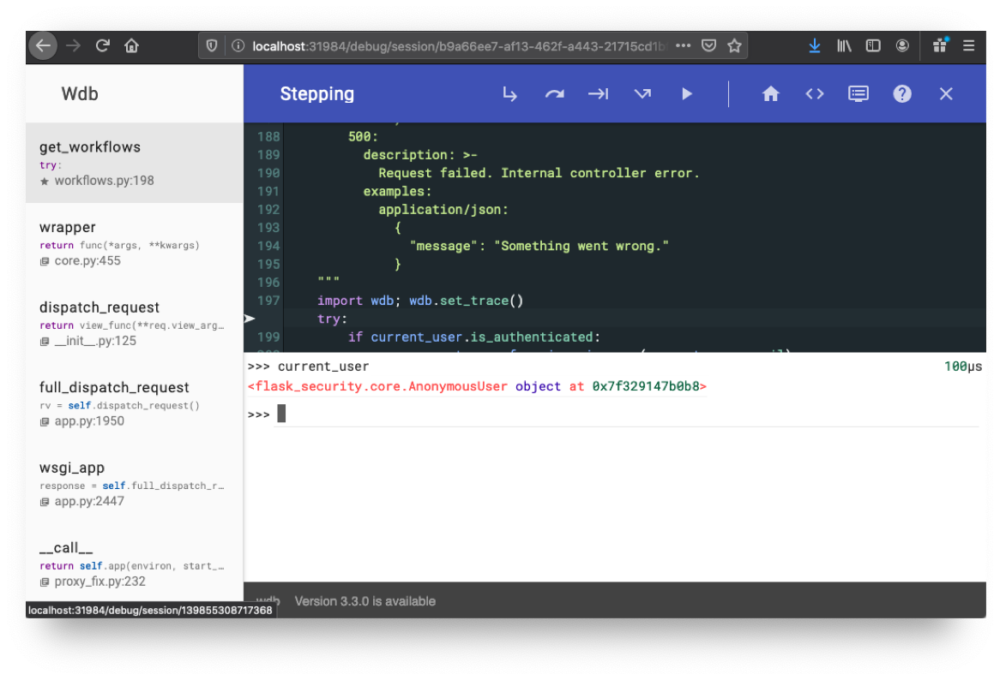

# Debugging

Deploy REANA in debug mode:

**1.** Create the cluster with the REANA source code mounted:

```console
$ reana-dev cluster-create --mode=debug
```

**2.** Build the component you want to debug with debugging dependencies:

```console
$ reana-dev docker-build -b DEBUG=1 -c reana-server
```

**3.** Deploy:

```console
$ reana-dev cluster-deploy --mode=debug
```

**4.** Add a breakpoint (using [wdb](https://github.com/Kozea/wdb)) in the [list workflows endpoint](https://github.com/reanahub/reana-server/blob/94421a4cf4effb8370ec7eaabfa03a72d2edb53f/reana_server/rest/workflows.py#L197) and call `reana-client list`:

```diff
    """
+   import wdb; wdb.set_trace()
    try:
```

**5.** Open the debugging session:

```console
$ firefox http://localhost:31984
```


