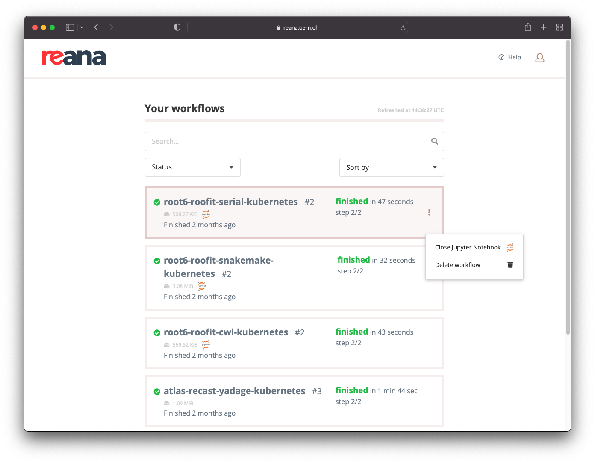

# Closing active sessions

## Jupyter notebooks based sessions

### Close from command line

You can shut down a running Jupyter notebook session from the REANA-Client
as follows:

```console
$ reana-client list --sessions
NAME         RUN_NUMBER   CREATED               SESSION_TYPE   SESSION_URI                                                                           SESSION_STATUS
jupyter      1            2021-12-01T14:33:26   jupyter        https://reana.cern.ch/f8be55e4-5d18-43f9-b977-f773fdcab163?token=<your-reana-token>   created

$ reana-client close -w jupyter
==> SUCCESS: Interactive session for workflow jupyter was successfully closed
```

You would typically use this command after you finished exploring data
in the Jupyter notebook and after you have transferred any code created
in your interactive session.

### Close from web interface

When a workflow has an associated Jupyter notebook session opened, a
Jupyter icon will appear next to the workflow name.

To close the notebook session, go through a list of your workflows and
click on the vertical ellipsis menu on the right-hand-side and select
"Close Jupyter Notebook".


