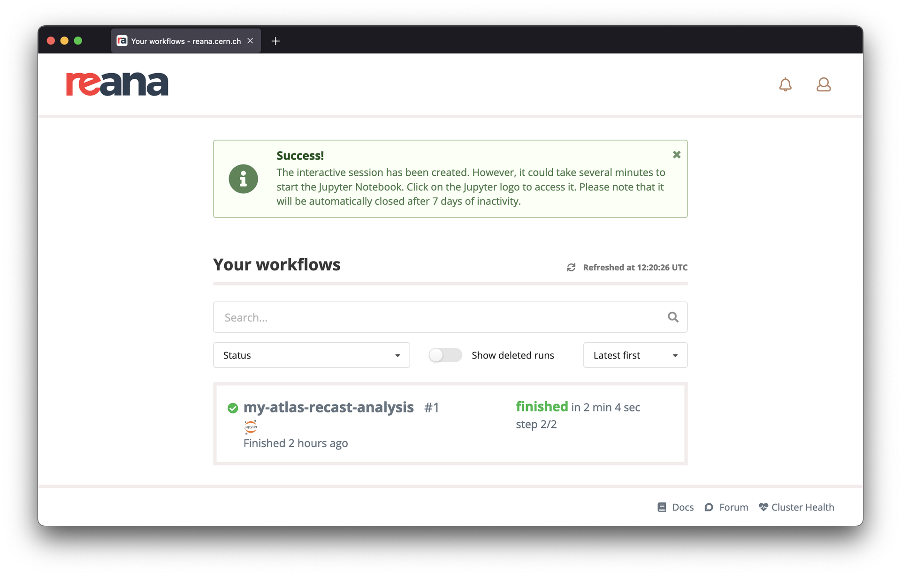

# Closing sessions

## Jupyter notebooks based sessions

### Close from command line

You can shut down a running Jupyter notebook session from the REANA-Client
as follows:

```console
$ reana-client list --sessions
NAME         RUN_NUMBER   CREATED               SESSION_TYPE   SESSION_URI                                                                           SESSION_STATUS
jupyter      1            2021-12-01T14:33:26   jupyter        https://reana.cern.ch/f8be55e4-5d18-43f9-b977-f773fdcab163?token=<your-reana-token>   created

$ reana-client close -w jupyter
==> SUCCESS: Interactive session for workflow jupyter was successfully closed
```

You would typically use this command after you finished exploring data
in the Jupyter notebook and after you have transferred any code created
in your interactive session.

### Close from web interface

When a workflow has an associated Jupyter notebook session opened, a
Jupyter icon will appear next to the workflow name.

To close the notebook session, go through a list of your workflows and
click on the vertical ellipsis menu on the right-hand-side and select
"Close Jupyter Notebook".


### Auto-closure of inactive sessions

Administrators can configure REANA to automatically close unused interactive sessions
after a given period of inactivity in order to free unused resources.
When you start an interactive session, you will be informed about how long
your inactive sessions will be kept open before they are automatically closed.

On the web interface:


On the command line:

```console
$ reana-client open -w my-atlas-recast-analysis jupyter
==> SUCCESS: Interactive session opened successfully
https://reana.cern.ch/69882819-b0a2-4aac-bd88-3bb4a4e5937a?token=<your-reana-token>
It could take several minutes to start the interactive session.
Please note that it will be automatically closed after 7 days of inactivity.
```

If the maximum period of inactivity is not reported in the notification, then the
session will stay open "forever" until you close it manually.

Please ensure your notebook work is periodically saved in order to avoid losing
any unsaved progress in case your session becomes inactive and in risk of being
automatically closed.
