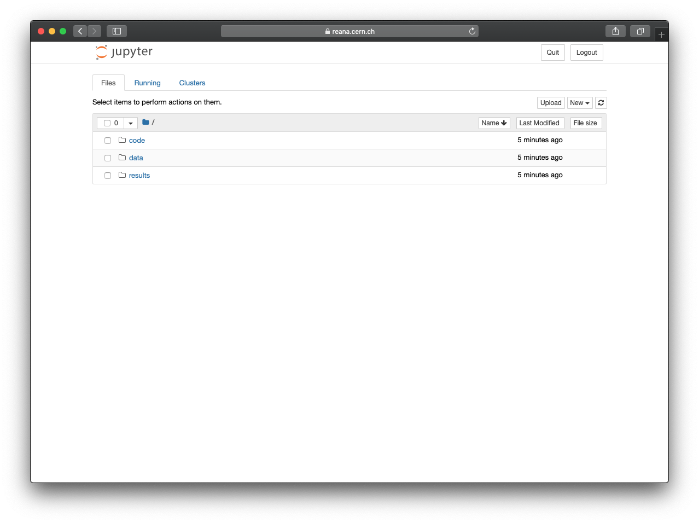
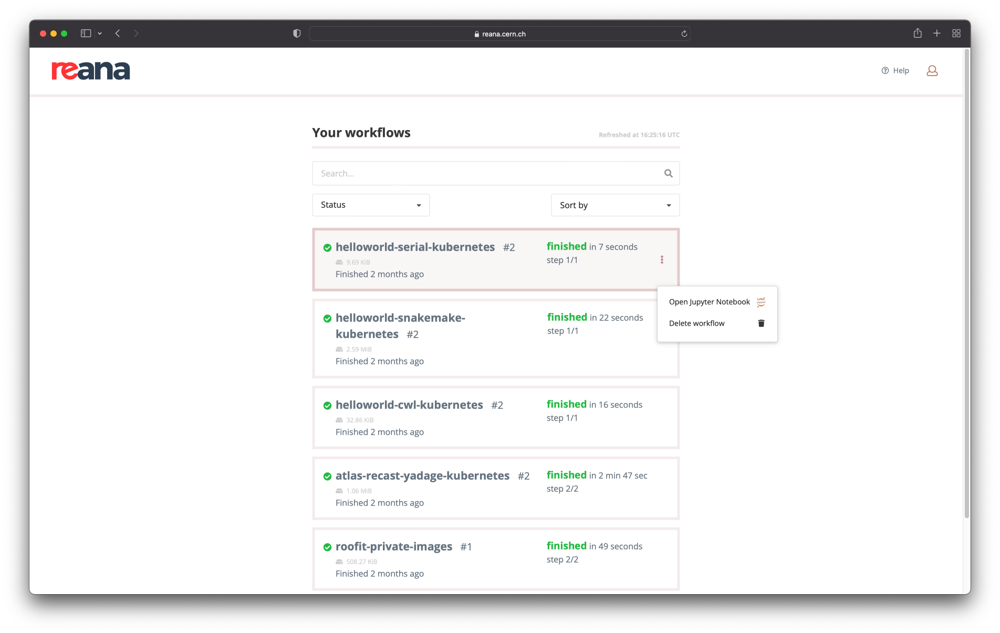

# Opening sessions

## Jupyter notebooks based sessions

### Open from command line

You can open Jupyter notebook sessions from the REANA-Client as follows:

```console
$ reana-client open jupyter -w helloworld
==> SUCCESS: Interactive session opened successfully
https://reana.cern.ch/f8be55e4-5d18-43f9-b977-f773fdcab163?token=<your-reana-token>
It could take several minutes to start the interactive session.
```

By default, newly opened sessions will use the
[`jupyter/scipy-notebook:notebook-6.4.5`](https://hub.docker.com/layers/jupyter/scipy-notebook/notebook-6.4.5/images/sha256-b6a4ce777b837496d5612b7ce4efba9aa015576cb6993817721b8d293a7c2a3c?context=explore) Docker image to spawn your notebook. You can supply
your desired image by passing it to the previous command with the
`-i/--image` option:

```console
$ reana-client open -w jupyter --image jupyter/scipy-notebook:notebook-6.4.7
==> SUCCESS: Interactive session opened successfully
https://reana.cern.ch/f8be55e4-5d18-43f9-b977-f773fdcab163?token=<your-reana-token>
It could take several minutes to start the interactive session.
```

By clicking on the link you will have access to a Jupyter notebook interface:



!!! note
    Keep in mind that this operation might take a minute, if you see
    "Service unavailable", just wait and retry.

### Open from web interface

Alternatively, you can also open Jupyter notebook sessions from the
REANA web interface by going through a list of your workflows and
clicking on the vertical ellipsis menu on the right-hand-side and
selecting "Open Jupyter Notebook":



When a workflow has an associated Jupyter notebook session opened, a
Jupyter icon will appear next to the workflow name; you can then click
on it to access the notebook.
