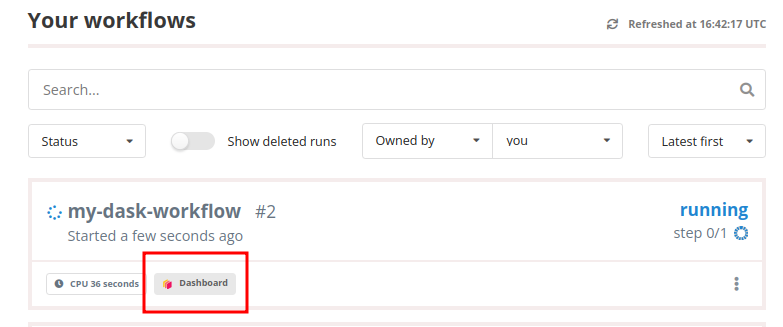
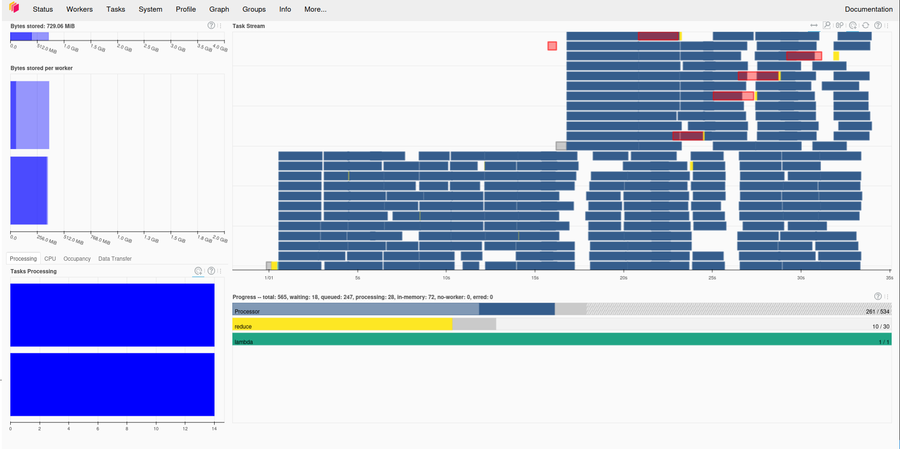

# Using Dask in workflows

REANA supports the integration of Dask clusters to provide scalable, distributed computing capabilities for workflows. This documentation explains how to request a dedicated Dask cluster for your workflow, query cluster settings, and use Dask features such as the dashboard for monitoring your workflows.

## Querying Dask support and limits

Dask support is optional and may not be enabled on your REANA cluster. Before configuring your workflow, run `reana-client info` and check the `Dask workflows allowed in the cluster` line. If Dask is not enabled, REANA rejects workflows that request Dask resources and explains that Dask workflows are not allowed on the cluster.

REANA administrators also configure Dask defaults and limits, such as the maximum cluster memory and whether the autoscaler is enabled. The same command displays these settings:

```console
$ reana-client info
...
Dask autoscaler enabled in the cluster: True
The number of Dask workers created by default: 2
The amount of memory used by default by a single Dask worker: 2Gi
The number of threads used by default by a single Dask worker: 4
The maximum memory limit for Dask clusters created by users: 16Gi
The maximum number of workers that users can ask for the single Dask cluster: 20
The maximum amount of memory that users can ask for the single Dask worker: 8Gi
The maximum number of threads that users can ask for the single Dask worker: 8
Dask workflows allowed in the cluster: True
...
```

The values reflect the configuration of each REANA cluster and may differ from those shown above.

## Configuring Dask in `reana.yaml`

If you would like to use Dask in your workflow, let REANA know by providing the appropriate resource hints. Add a `dask` block under `workflow.resources` in your `reana.yaml` file. For example, the following workflow configures a Dask cluster with up to five workers, 2Gi of memory per worker, and one thread per worker:

```{ .yaml .copy-to-clipboard }
inputs:
  files:
    - analysis.py
workflow:
  type: serial
  resources:
    dask:
      image: docker.io/coffeateam/coffea-dask-cc7:0.7.22-py3.10-g7f049
      number_of_workers: 5
      single_worker_memory: 2Gi
      single_worker_threads: 1
  specification:
    steps:
      - name: process
        environment: docker.io/coffeateam/coffea-dask-cc7:0.7.22-py3.10-g7f049
        commands:
          - python analysis.py
outputs:
  files:
    - histogram.png
```

When you run the workflow, REANA provisions the requested Dask cluster and makes it available to your analysis. The `dask` block accepts the following settings:

1. **`image`** (mandatory)
   specifies the Docker image used by the Dask scheduler and workers. This does not affect the job pod that executes your analysis, which uses the `environment` image defined for the workflow step. The Dask image should include all dependencies required by your cluster.

2. **`number_of_workers`** (optional)
   defines the maximum number of Dask workers for your cluster. With the autoscaler enabled (the default), the cluster scales between zero and this many workers depending on load. With the autoscaler disabled, the cluster starts with this fixed number of workers.

3. **`single_worker_memory`** (optional)
   sets the amount of memory allocated to each Dask worker.

4. **`single_worker_threads`** (optional)
   sets the number of threads allocated to each Dask worker. We recommend using one thread per worker for most analyses.

Your REANA cluster administrator defines defaults and maximums for the optional settings. The total memory requested for the Dask cluster, calculated as `number_of_workers` multiplied by `single_worker_memory`, must also fit within the cluster-wide Dask memory limit. If you omit either value, REANA uses the corresponding cluster default for this calculation. If you request more workers, memory, or threads than the cluster permits, REANA rejects the workflow submission and tells you which resource request should be reduced.

## Connecting to your Dask cluster

Your analysis code needs to connect to the Dask cluster that REANA creates from the workflow resource hints in your `reana.yaml`. REANA automatically injects the `DASK_SCHEDULER_URI` environment variable, which points to the scheduler of your dedicated Dask cluster. Always read this variable before creating the Dask client, for example:

```python
import os

from dask.distributed import Client

DASK_SCHEDULER_URI = os.getenv("DASK_SCHEDULER_URI", "tcp://127.0.0.1:8080")
client = Client(DASK_SCHEDULER_URI)
```

If `DASK_SCHEDULER_URI` is not set, the code uses the provided default value instead. You can also consult the [Dask demo workflow](https://github.com/reanahub/reana-demo-dask-coffea) for a full example combining the analysis code and `reana.yaml`.

## Consulting the Dask dashboard

You can inspect your analysis and Dask cluster via Dask dashboard by clicking the following icon under your workflow.



Depending on your REANA cluster's configuration, the dashboard may not be available. Ask your cluster administrator whether the deployment uses Traefik to expose Dask dashboards.

After clicking on the Dashboard button, you will be brought to the live interactive Dask dashboard, as shown below:


